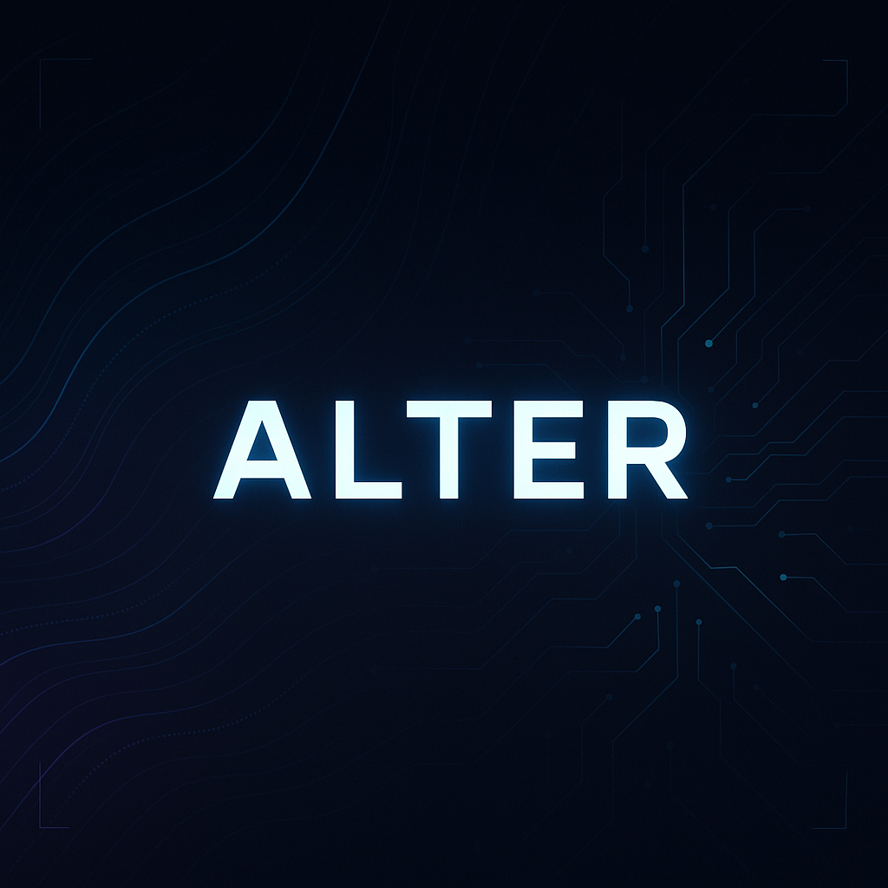

# ALTER - AI Code Debugger 🚀

## 🔥 Overview
ALTER is an AI-powered code debugger that helps users analyze and correct coding errors using the Gemini API. It includes authentication via Clerk and OAuth, and features a modern UI with dark mode support.

## ✨ Features
- ✅ AI Code Debugger: Fix errors with AI-powered suggestions.
- 🔑 Authentication: Secure login/signup with Clerk & OAuth.
- 🎨 Modern UI: Built with Vite, Tailwind CSS, and TypeScript.
- 🛠 Backend: Node.js server with API routes.
- 🗄 Database: Supabase for user data & code history.
- 📊 Admin Dashboard: Manage users & debugging history.
- 🌗 Light & Dark Mode: Seamless theme switching.

---

## 📂 Project Structure
ALTER/
├── client/ # Frontend code
├── server/ # Backend API
├── shared/ # Shared utilities
├── attached_assets/ # Static assets
├── package.json     # Dependencies
├── tailwind.config.ts # Tailwind
├── tsconfig.json    # TypeScript configuration

├── vite.config.ts  # Vite setup
---

## 🚀 Getting Started
### ✅ Prerequisites
Ensure you have the following installed:
- [Node.js](https://nodejs.org/) (Latest LTS version)
- [Git](https://git-scm.com/)
- [Supabase](https://supabase.com/) account for database setup
- [Clerk](https://clerk.dev/) account for authentication

### 🔧 Installation
# Clone the repository
 git clone https://github.com/DragAditya/ALTER.git
 cd ALTER

# Install dependencies
 npm install
### ⚙️ Environment Variables
Create a .env file in the root directory and add:
SUPABASE_URL=your_supabase_url
SUPABASE_KEY=your_supabase_key
CLERK_API_KEY=your_clerk_api_key
GEMINI_API_KEY=your_gemini_api_key
### ▶️ Run the Development Server
npm run dev
Access the app at: http://localhost:3000

---

## 🚀 Deployment
- Frontend: Deploy on [Vercel](https://vercel.com/).
- Backend: Host using [Railway](https://railway.app/) or [Render](https://render.com/).
- Environment Variables: Configure on the hosting platform.

---

## 🤝 Contributing
Contributions are welcome! To contribute:
1. Fork the repo.
2. Create a new branch.
3. Commit your changes.
4. Submit a Pull Request.

---

## 📜 License
This project is licensed under the MIT License.

---

## 📧 Contact
🔗 GitHub: [@DragAditya](https://github.com/DragAditya)
📩 Email: waghaditya312@gmail.com

---
> Star ⭐ this repo if you found it useful!
> Detailed Tutorial : .[Access Tutorial](https://code2tutorial.com/tutorial/adc1113b-50d1-4467-99cf-a3699a5dea07/index.md)
